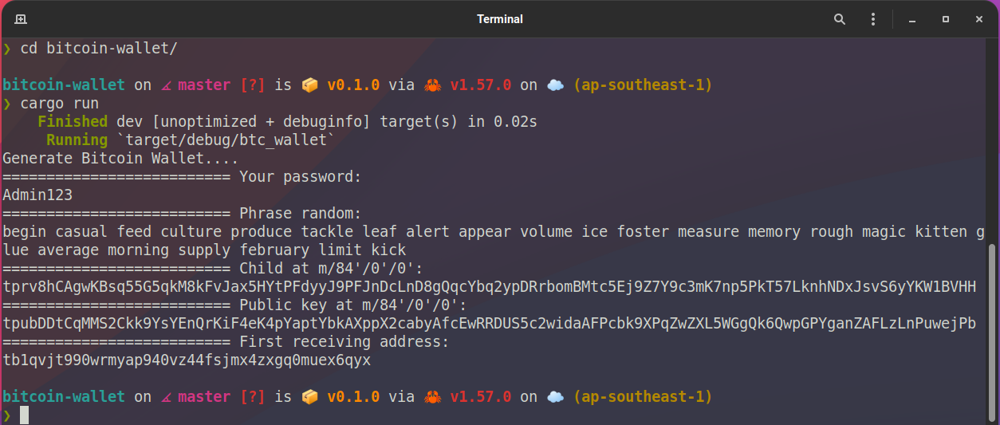

# BTC Wallet

How to generate Bitcoin Address, Bitcoin Wallet on Rust




## Requires:

* bip32 = "0.3.0"
* rand_core = { version = "0.6", features = ["std"] }
* bitcoin = "0.26"

## How to run

```bash
cargo build
cargo run
```